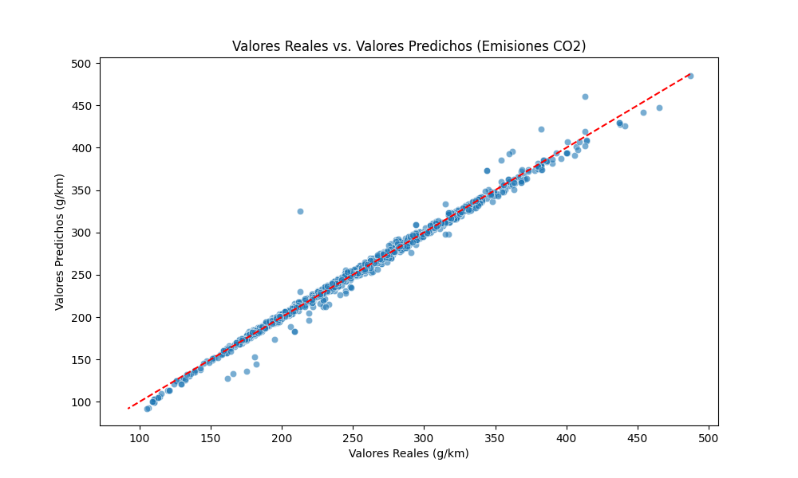

# 🚀 Proyecto de Pipeline de Emisiones de CO2


Este es un proyecto completo de Data Science que implementa un pipeline de Machine Learning de principio a fin para predecir las emisiones de CO2 de vehículos, basado en el [dataset de Kaggle](https://www.kaggle.com/datasets/debajyotipodder/co2-emission-by-vehicles).

El enfoque principal de este proyecto no es solo el modelo en sí, sino la **implementación de una estructura de código modular, limpia y profesional**, similar a la que se utiliza en entornos de trabajo reales.

---

## 📊 Resultados del Modelo

El pipeline entrena un modelo de Regresión Lineal Múltiple para predecir las emisiones de CO2. El modelo final se evalúa automáticamente y genera el siguiente gráfico de **Valores Reales vs. Predichos**, que se guarda en la carpeta `reports/`.

Una línea diagonal perfecta indicaría un modelo perfecto. Como se puede ver, el modelo es altamente preciso.




| Métrica | Resultado |
| :--- | :--- |
| **R-squared (R²)** | ~0.90+ |
| **RMSE** | 34.5731 |
| **MSE** | 5.8799 |

*(Nota: Los resultados exactos pueden variar ligeramente)*

---

## ✨ Características Principales

* **Estructura Modular:** El código está separado en módulos lógicos (`data_loader`, `data_cleaning`, `data_processing`, `model`) dentro de la carpeta `src/`.
* **Pipeline Automatizado:** Un solo script (`main.py`) orquesta todo el flujo de trabajo: carga, limpieza, procesamiento y entrenamiento.
* **Gestión de Entorno:** Utiliza `venv` y `requirements.txt` para una reproducibilidad total.
* **Preprocesamiento:** Aplica técnicas clave como **One-Hot Encoding** a características categóricas (`fuel_type`).
* **Evaluación y Visualización:** Genera y guarda automáticamente métricas (R², MSE, RMSE) y un gráfico de resultados.
* **Separación de Intereses:**
    * `notebooks/`: Para la exploración inicial (EDA).
    * `src/`: Para el código de producción del pipeline.
    * `models/`: Para guardar el modelo final (`.joblib`).
    * `reports/`: Para guardar los artefactos de evaluación (gráficos).

---

## 📁 Estructura del Proyecto

La estructura del repositorio está diseñada para ser escalable y mantenible.

```

proyecto-emisiones-co2/
│
├── .git/
├── Data/
│   └── CO2\_Emissions.csv       \# Datos crudos
├── models/
│   └── co2\_model.joblib        \# Modelo entrenado (generado)
├── notebooks/
│   └── EDA.ipynb               \# Análisis Exploratorio (el "laboratorio")
├── Reports/
│   └── actual\_vs\_predicted.png \# Gráfico de resultados (generado)
├── src/
│   ├── **init**.py
│   ├── config.py               \# Rutas y configuración
│   ├── data\_cleaning.py        \# Módulo de limpieza
│   ├── data\_loader.py          \# Módulo de carga
│   ├── data\_processing.py      \# Módulo de preprocesamiento
│   └── model.py                \# Módulo de entrenamiento y evaluación
│
├── .gitignore                  \# Ignora venv, models, reports, etc.
├── LICENSE                     \# Licencia MIT
├── main.py                     \# 🚀 Script "cerebro" para ejecutar todo
├── README.md                   \# Esta documentación
└── requirements.txt            \# Dependencias de Python

````

---

## 🛠️ Instalación y Configuración

Sigue estos pasos para configurar tu entorno local y ejecutar el proyecto.

**1. Clonar el Repositorio**
```bash
git clone https://[TU_URL_DE_GITHUB]/proyecto-emisiones-co2.git
cd proyecto-emisiones-co2
````

**2. Crear y Activar un Entorno Virtual**

```bash
# Crear el entorno
python -m venv venv

# Activar en macOS/Linux
source venv/bin/activate

# Activar en Windows
.\venv\Scripts\activate
```

**3. Instalar las Dependencias**

```bash
pip install -r requirements.txt
```

-----

## ▶️ Cómo Ejecutar el Pipeline

Con tu entorno virtual activo, simplemente ejecuta `main.py` desde la raíz del proyecto.

```bash
python main.py
```

El script se encargará de todo:

1.  Limpiará la terminal.
2.  Irá ejecutando cada paso del pipeline, imprimiendo su estado.
3.  Imprimirá las métricas de evaluación (R², MSE, RMSE) en la terminal.
4.  Guardará el modelo entrenado en `models/co2_model.joblib`.
5.  Guardará el gráfico de resultados en `reports/actual_vs_predicted.png`.

-----

## 🔬 Análisis Exploratorio (EDA)

Si deseas ver el análisis exploratorio inicial (gráficos de correlación, distribución de datos, etc.) que se realizó antes de construir el pipeline, puedes ejecutar el notebook que se encuentra en:

`notebooks/EDA.ipynb`

(Asegúrate de tener Jupyter instalado: `pip install jupyter`).

---

## 👨‍💻 Autor

**Emmanuel Tapia**

* [](https://www.linkedin.com/in/emmanuel-mtapia/)
* [](https://mtemmanue.github.io/Portafolio_Data_Emmanuel/)

---
